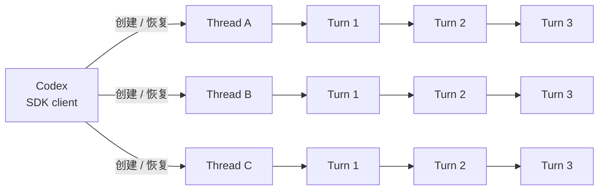
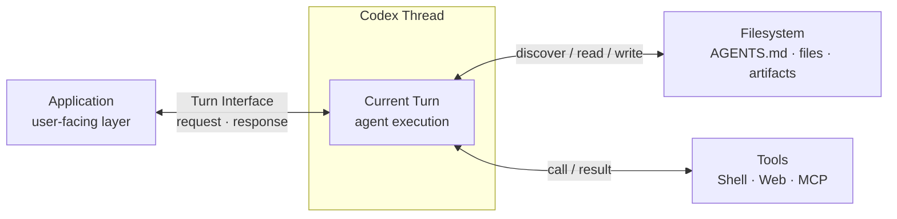

Codex 有多种常见的使用方式：可以通过 Codex App 在桌面端使用，通过 Codex CLI 在终端中使用，也可以通过 IDE extension 在 VS Code 中协作。这些方式主要由人直接发起和查看任务；Codex SDK 则提供了另一条路径——以程序代码方式启动和控制 Codex。

SDK 的全称是 **Software Development Kit**，中文通常译作“软件开发工具包”。OpenAI 目前提供 TypeScript 和 Python 两种 Codex SDK；本文从 TypeScript 版本开始。`@openai/codex-sdk` 是 OpenAI 官方发布的 npm package，也是供服务端 Node.js 应用使用的 TypeScript library。


先通过一张图理解三个核心概念之间的关系：



可以把这三个概念与 Codex App 的使用体验做一个大致对照：整个 App 类似于 SDK 中的 `Codex` client，负责创建和管理多条会话；侧边栏中的一条独立 chat 大致对应一个 `Thread`；在这条 chat 中发送一次 prompt，直到 Codex 完成工作并给出响应，则大致对应一个 `Turn`。

一个 `Codex` client 可以创建或恢复多个彼此独立的 `Thread`。不同 `Thread` 可以由 application 并发推进；同一 `Thread` 内的 `Turn` 则形成有顺序的连续对话，通常应等待前一个 `Turn` 完成后再开始下一个。

- `Codex`：SDK 的入口对象，用于创建或恢复 `Thread`。
- `Thread`：一条独立、可持续交互的会话线，保存多个 `Turn` 之间的上下文。
- `Turn`：一次用户输入及 Codex 响应；同一 `Thread` 中的多个 `Turn` 按顺序推进。

映射到代码，最小调用就是创建 `Codex`、启动 `Thread`，再运行一个 `Turn`：

```ts
// case1.ts

import { Codex } from "@openai/codex-sdk";

const codex = new Codex();
const thread = codex.startThread();
const result = await thread.run("生成 SVG：一辆自行车");

console.log(result.finalResponse);
```


## Thread

`Thread` 是 application 与 Codex 进行一条连续协作的会话对象。它保存这条会话的上下文，可以依次运行多个 `Turn`。

从 `Thread` 的角度看，最核心的操作就是：给它一份输入，让它推进一个新的 `Turn`。SDK 提供了两种运行方式：

```text
Thread
  ├── run(input)          → 等待 Turn 完成，再取得完整结果
  └── runStreamed(input)  → Turn 执行期间，逐条取得事件
```

#### `thread.run()`

```ts
const result = await thread.run("分析这个项目");

console.log(result.finalResponse);
```

`run()` 会等待本次 `Turn` 完成，然后返回完整结果。在同一个 `Thread` 上再次调用 `run()`，就是带着已有上下文继续下一轮：

```ts
await thread.run("prompt 1");
await thread.run("prompt 2");
```

#### `thread.runStreamed()`

```ts
const { events } = await thread.runStreamed("分析并修复这个项目");

for await (const event of events) {
  console.log(event.type);
}
```

`runStreamed()` 同样推进一个新的 `Turn`，但 application 可以在执行过程中持续消费产生的事件，以便实时展示进度或响应中间状态。

因此，两者的核心区别不是“执行什么”，而是“如何观察执行过程”：`run()` 等整场结束后取得结果，`runStreamed()` 则可以边执行边接收事件。


## Turn

`Turn` 是 `Thread` 上的一次完整执行：它从一份 input 开始，经过 Codex 的处理，最终形成这次执行的结果。调用 `thread.run()` 时，得到的 `result` 就是一个完成后的 `Turn`。

在 `@openai/codex-sdk@0.148.0` 中，`Turn` 的结构如下：

```ts
type Turn = {
  items: ThreadItem[];
  finalResponse: string;
  usage: Usage | null;
};
```

也可以把它直观地理解为：

```text
Turn
  ├── finalResponse  → 最终文本回答
  ├── items[]        → 本轮产生的结构化内容
  └── usage          → 本轮的 token 使用信息
```

`finalResponse` 与 `items` 面向两种不同需求：如果 application 只需要向用户展示最终回答，读取 `finalResponse` 通常就够了；如果还需要以程序方式了解 Codex 在本轮产生了哪些内容，则要继续查看 `items`。因此，`finalResponse` 是 `Turn` 的便捷最终输出，但并不代表 `Turn` 的全部结构。


## Codex

这里的 `Codex` 特指从 `@openai/codex-sdk` 导入的 class。它是 SDK 的入口对象，封装了 Application 对本地 Codex runtime 的访问，但本身不代表一条会话，也不保存某个 Thread 的对话上下文。

从 `Codex` 的角度看，最核心的操作是创建或恢复 Thread：

```text
Codex
  ├── startThread(ThreadOptions)            → 创建新的 Thread
  └── resumeThread(threadId, ThreadOptions) → 恢复已有的 Thread
```

一个 `Codex` client 可以产生多个彼此独立的 Thread；每条 Thread 分别维护自己的 context，并通过各自的 `run()` / `runStreamed()` 推进 Turn。

#### `codex.startThread()`

```ts
const codex = new Codex();

const thread = codex.startThread({
  model: "<model-id>",                    // 替换为实际 model ID；覆盖默认 model
  workingDirectory: process.cwd(),         // Thread 的主要工作目录
  additionalDirectories: ["/path/to/data"], // 额外允许访问的目录

  sandboxMode: "workspace-write",         // 允许修改 workspace，限制其它位置的写入
  approvalPolicy: "never",                // 不请求人工批准；安全边界依赖 sandbox
  networkAccessEnabled: false,             // sandbox 内的 command 不访问 network
  webSearchMode: "disabled",               // 关闭 Codex 的 Web search
});
```

`startThread()` 创建一条新的会话线，并用可选的 `ThreadOptions` 初始化它。核心参数可以分成三组：`model` 选择执行所用的模型；`workingDirectory` 与 `additionalDirectories` 定义 filesystem scope；`sandboxMode`、`approvalPolicy`、`networkAccessEnabled` 和 `webSearchMode` 共同定义 Thread 的安全与能力边界。这些配置会保存在 Thread 上，并用于后续各个 Turn。

此时只得到了 `Thread` 对象；真正的第一个 Turn 要等到调用 `thread.run()` 或 `thread.runStreamed()` 时才开始。

#### `codex.resumeThread()`

```ts
const thread = codex.resumeThread(threadId);
const result = await thread.run("继续上一次任务");
```

`resumeThread()` 根据 `threadId` 重新取得一条已经持久化的会话，使后续 Turn 能继续使用原有 context。新建 Thread 的 `id` 会在第一个 Turn 启动后可用，Application 可以保存该 ID，以便之后恢复。

配置上需要区分两个层级：传给 `new Codex()` 的 `CodexOptions` 作用于 SDK client 与 runtime；传给 `startThread()` / `resumeThread()` 的 `ThreadOptions` 则作用于具体 Thread。


## Application 与 Codex Thread 的信息通讯方式

#### 背景设定

假设 Application 的某个环节需要调用 Codex，那么从信息通讯的角度，首先要回答两个方向的问题：Application 如何向 Codex Thread 发送信息，以及 Application 如何从 Codex Thread 接收信息。这里的“信息”取广义含义，并不局限于 `thread.run()` 直接传入的 text message；例如，Application 把文件写入 Thread 的 `workingDirectory`，同样是在向 Thread 提供信息。

Application 与 Codex Thread 的通讯不是一条独立 channel，而是一个上层的信息分配问题：Application 需要根据不同信息的性质，选择并组合 Thread 与外界的多种通讯方式。

#### Thread 与外界的三类 channel

要回答这个问题，需要先观察 Codex Thread 与外界有哪些信息交换方式。可以将它们归纳为三类 channel：



这三条 channel 在时序上并不完全平级：**Turn Interface** 是 Turn 面向 Application 的直接外部边界；Filesystem 与 Tools 则是 Turn 执行期间可能使用的内部工作通道。Turn Interface 不是 Codex SDK 导出的 type，而是本文采用的分析性名称。

- **Turn Interface**：Application 通过 `Input` 和 `TurnOptions` 发送 request，通过 `Turn` 或 `ThreadEvent` 接收 response，再决定如何向 user 呈现；`outputSchema` 可进一步约束 `finalResponse` 的 JSON 结构。
- **Filesystem**：Turn 执行期间可以读写共享文件，Application 也可以在 Turn 前后准备或消费这些文件。`workingDirectory` 只定义可访问范围，不会自动加载全部文件；`AGENTS.md` 则是 Codex 自动发现的 persistent instruction。
- **Tools**：Turn 执行期间可以通过 Shell、Web 或 MCP 调用外部能力；tool result 会参与本轮执行，并可作为 `ThreadItem` / `ThreadEvent` 经 Turn Interface 暴露给 Application。

#### Application 的信息分配

更本质地说，Application 分配的不是某种具体数据格式，而是生命周期、作用域和 ownership 不同的四类信息：

| 信息角色 | 本质 | Channel |
| --- | --- | --- |
| 本轮交互 | 以一次 Turn 为直接交换边界，表达当前意图、执行控制与反馈 | Turn Interface |
| 行为约束 | 定义 Thread 应当如何工作，跨 Turn 生效，并随目录层级确定作用域 | Filesystem：`AGENTS.md` |
| 持久共享状态 | 独立于对话存在，由 Application 与 Thread 共同读写，可作为业务 source of truth | Filesystem |
| 外部交互 | 运行时按需获取外部信息或改变外部状态，不由 Thread 自身持有 | Tools |

#### 通信边界与 Thread 状态

`startThread(ThreadOptions)` 本身不是一条信息 channel，它的作用是初始化部分通信边界：目录配置决定 Filesystem scope，`sandboxMode` 和 `approvalPolicy` 决定操作权限，`networkAccessEnabled` 和 `webSearchMode` 决定外部访问能力。真正按轮次发生的直接交换，则由后续的 `run()` 或 `runStreamed()` 推进：

```text
startThread(ThreadOptions)
  → 配置 channel 的范围、能力与 policy

run(input, TurnOptions)
  → 在既定边界内交换信息并推进一个 Turn
```

先前 `Turn` 的 context 不属于外部 channel，而是 `Thread` 内部维护的会话状态。它会参与下一次执行，并在新的 `Turn` 完成后继续更新。

#### Artifact-Oriented Application

Artifact-oriented application 的核心输出不是一段回答文本，而是一个需要持续读取、修改和管理的 artifact。可以按信息职责进行如下分配：

| 信息职责 | 方向 | Channel | 承载内容 |
| --- | --- | --- | --- |
| Persistent instruction | Application → Thread | Filesystem：`AGENTS.md` | artifact 规范、目录语义和操作边界 |
| 本轮交互 | Application ↔ Thread | Turn Interface | Application 发送 `Input` 与 `TurnOptions`，Thread 返回 `Turn` 或 `ThreadEvent` |
| 业务 artifact | Application ↔ Thread | Filesystem | artifact 本体及其关联文件 |
| 外部交互 | Thread ↔ 外界 | Tools | 查询、验证、转换或发布，以及相应的 tool result |

对于 artifact-oriented application，Filesystem 中的 artifact 应作为内容的 source of truth；Turn Interface 的 response 只承担 execution receipt，例如状态、摘要、warning 和 artifact reference，而不重复承载完整 artifact。如果 Application 需要稳定解析这份 receipt，可以在 request 的 `TurnOptions` 中通过 `outputSchema` 约束 `finalResponse` 的 JSON 结构。


## 展开理解

#### `thread.run()`

前面已经知道，`thread.run()` 会在 `Thread` 上推进一个新的 `Turn`。现在进一步展开它的接口：

```ts
run(input: Input, turnOptions?: TurnOptions): Promise<Turn>
```

第一个参数 `input` 是交给 Codex 的任务内容。它可以是一段 string，也可以是由 text 和 local image 组成的结构化数组：

```ts
type Input = string | UserInput[];

type UserInput =
  | { type: "text"; text: string }
  | { type: "local_image"; path: string };
```

例如，同时传入 prompt 和一张本地图片：

```ts
const result = await thread.run([
  { type: "text", text: "分析这张界面截图" },
  { type: "local_image", path: "./ui.png" },
]);
```

第二个参数 `turnOptions` 是可选的本轮控制参数，不是任务内容：

```ts
type TurnOptions = {
  outputSchema?: unknown; // 约束最终输出的 JSON 结构
  signal?: AbortSignal;   // 允许 application 取消本轮执行
};
```

参考：[Codex SDK 官方文档](https://learn.chatgpt.com/docs/codex-sdk)
