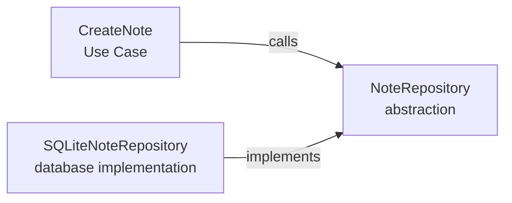
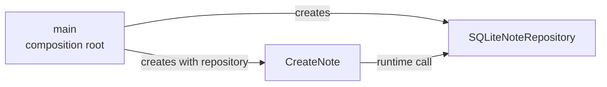

在分层系统中，runtime call 通常是：

```text
业务代码 → infra（例如 database）
```

这很自然。但如果 source code 也沿着这个方向组织，业务代码就需要直接使用具体 database 或 Object-Relational Mapping（ORM，对象关系映射）API。

这带来的问题是：**即使业务规则没有改变，infra 的变化也可能迫使业务代码修改**。

这里，policy 指系统要执行的业务规则和 Use Case workflow；detail 指完成这些规则所使用的 database、ORM 或 external service 等技术方式。

Dependency Inversion Principle（DIP，依赖倒置原则）的核心思想是：**high-level policy 和 low-level detail 都依赖由业务需要定义的 abstraction，具体 infra 再去实现它**。

下面以保存 Note 为例，观察 runtime call 与 source code 如何形成不同的依赖方向。

## 1. 依赖关系

> Mental model：如果 A 必须知道 B 才能工作，A 就依赖 B。

假设 `CreateNote` Use Case 直接使用 SQLite implementation：

```python
# application/use_case.py
from infrastructure.database import SQLiteNoteRepository


class CreateNote:
    def __init__(self, repository: SQLiteNoteRepository):
        self.repository = repository

    def execute(self, text: str) -> None:
        if not text.strip():
            raise ValueError("Note cannot be empty")

        self.repository.save(text)
```

`CreateNote` 必须 import 并使用 `SQLiteNoteRepository`。因此从 source code 看，方向是：

```text
CreateNote → SQLiteNoteRepository
```

箭头从 dependent 指向 dependency。这里，`CreateNote` 是 dependent，`SQLiteNoteRepository` 是 dependency。

## 2. Runtime call 与 source code

上面的代码包含两个方向相同、含义不同的关系：

```text
runtime call:  CreateNote → SQLiteNoteRepository
source code:   CreateNote → SQLiteNoteRepository
```

Runtime call 来自：

```python
self.repository.save(text)
```

从 source code 看，方向由 import 决定：

```python
from infrastructure.database import SQLiteNoteRepository
```

DIP 不会消除 Use Case 对 database implementation 的 runtime call；它要改变的是 source code 中的方向。

## 3. 引入 Repository abstraction

首先由 application 定义自己需要的 Persistence API：

```python
# application/repository.py
from abc import ABC, abstractmethod


class NoteRepository(ABC):
    @abstractmethod
    def save(self, text: str) -> None:
        ...
```

Use Case 只使用 `NoteRepository`：

```python
# application/use_case.py
from application.repository import NoteRepository


class CreateNote:
    def __init__(self, repository: NoteRepository):
        self.repository = repository

    def execute(self, text: str) -> None:
        if not text.strip():
            raise ValueError("Note cannot be empty")

        self.repository.save(text)
```

Database implementation 再实现这个 abstraction：

```python
# infrastructure/database.py
import sqlite3

from application.repository import NoteRepository


class SQLiteNoteRepository(NoteRepository):
    def __init__(self, connection: sqlite3.Connection):
        self.connection = connection

    def save(self, text: str) -> None:
        self.connection.execute(
            "INSERT INTO notes (text) VALUES (?)",
            (text,),
        )
        self.connection.commit()
```



两条箭头的含义不同：`CreateNote` 调用 Repository abstraction，`SQLiteNoteRepository` 继承并实现它。从 source code 看，双方都 import application 定义的 `NoteRepository`，Use Case 不再知道 SQLite。

Runtime 中，`repository` 可以指向一个 `SQLiteNoteRepository` instance。整个关系可以概括为：

```text
Use Case → Repository abstraction ← Database implementation
```

## 4. Composition root 与 Dependency Injection

最后，由 application 外部的 entry point 选择具体 database implementation：

```python
# main.py
import sqlite3

from application.use_case import CreateNote
from infrastructure.database import SQLiteNoteRepository


connection = sqlite3.connect("notes.db")
repository = SQLiteNoteRepository(connection)
create_note = CreateNote(repository)
```

`main.py` 同时知道 Use Case 和 database implementation，负责创建并连接它们。这个组装位置称为 **composition root**。



`CreateNote` 不自己创建 repository，而是通过 constructor 从外部接收，这称为 **Dependency Injection（DI，依赖注入）**。

DIP 让 application 的 source code 不再指向 infra；DI 负责在 runtime 提供具体 implementation。`main.py` 可以依赖 application 和 infra，但 application 不依赖 infra。

## 5. Abstraction 的 ownership

仅仅增加 abstract class 还不够。如果 `NoteRepository` 由 infrastructure 定义，Use Case 仍然需要 import infrastructure：

```text
application → infrastructure.NoteRepository
```

因此，`NoteRepository` 应由 application 拥有，并按照 Use Case 的需要设计。

> Mental model：DIP 倒置的不只是 import direction，也是 boundary contract 的定义权。

在这个例子中，Use Case 需要的是“保存 Note”：

```python
class NoteRepository(ABC):
    @abstractmethod
    def save(self, text: str) -> None:
        ...
```

如果 abstraction 暴露的是 database 操作：

```python
class NoteRepository(ABC):
    @abstractmethod
    def execute(self, sql: str, parameters: tuple) -> None:
        ...

    @abstractmethod
    def commit(self) -> None:
        ...
```

那么 Use Case 仍然需要用 SQL 和 transaction 的语言思考。虽然代码依赖了 abstract class，boundary contract 依旧由 low-level detail 塑造。

真正的 DIP 是由 high-level policy 描述自己需要的能力，再让 database implementation 把这个能力翻译成 SQL、ORM operations 和 transaction。

## 6. DIP 的适用边界

DIP 会增加 abstraction、implementation 和 composition code，因此不需要为每个 function 或 class 都创建 interface。

它主要用于 high-level policy 跨越技术边界的地方，例如：

- database
- file system
- external API
- message broker
- clock 或 random source

`NoteRepository` 值得抽象，是因为 persistence 位于 application 与 infrastructure 的边界。相反，一个只在 application 内部使用的纯函数，通常不需要为了 DIP 再增加 abstract class。

> Mental model：DIP 抽象的是需要保护 policy 的边界，而不是所有代码。

## 总结

DIP 不会消除 concrete implementation，也不会倒转 runtime call。Use Case 在运行时仍然通过 Repository 调用 database implementation：

```text
runtime call:  Use Case → Database implementation
```

改变的是 source code 和 boundary contract 的定义权：

```text
source code:  Use Case → Repository abstraction ← Database implementation
```

Application 用自己的语言定义 Repository abstraction，database implementation 负责适配它，composition root 则在 runtime 选择并注入具体实现。

> Runtime 中，业务调用技术；source code 中，技术适配业务。
