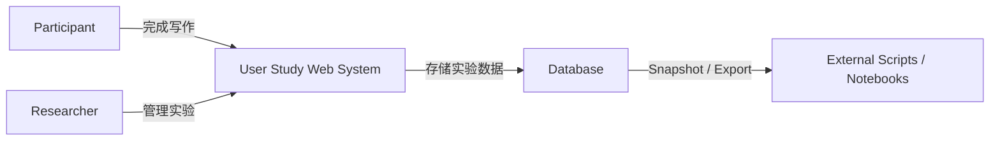
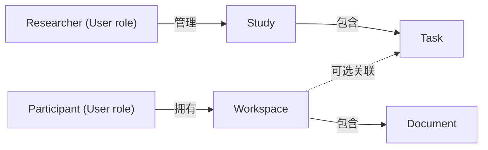
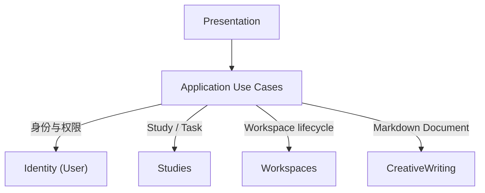
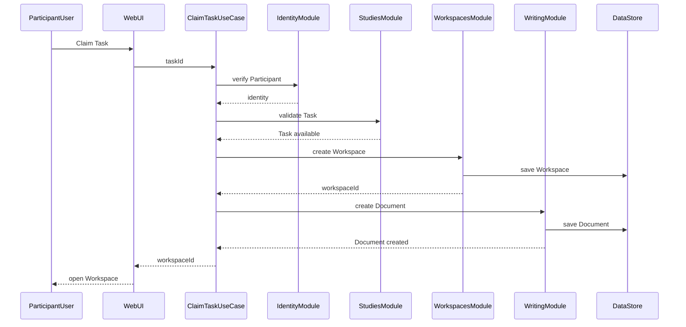

本文直接讨论一个 Web-based User Study 系统的代码架构设计，并以 Markdown 创意写作作为具体案例。Participant 可以领取 Task 并在 Workspace 中完成写作，也可以脱离 Study 创建 Workspace 自由写作；Researcher 则负责管理 Participants、设计 Study 和发布 Tasks。

先明确 system boundary：Web 系统负责实验运行与数据采集，不负责实验结果分析。分析由外部 scripts 或 notebooks 读取 database snapshot 或 exported data 完成。



创意写作足够简单，可以让讨论集中在多用户、角色权限、任务流程和数据隔离等核心问题；同时，Study、Task、Workspace 也能代表一类通用的 User Study 系统。

## 代码架构设计流程

代码架构设计从需求出发，逐步把业务问题转化为可以实现和验证的软件结构：

1. **Requirements Analysis**：明确系统目标、用户角色、核心场景和范围边界。
2. **Use Case Analysis**：描述不同角色如何使用系统，识别系统需要支持的核心操作。
3. **Domain Modeling**：从 Use Cases 中提取稳定的业务概念及其关系。
4. **Module Design**：按照职责划分模块，明确模块边界和依赖方向。
5. **Data Flow Design**：分析一次操作如何经过 UI、API、业务逻辑和数据库。
6. **Technical Design**：选择 frontend、backend 和 database，并设计 API、数据表和代码目录。
7. **Implementation and Review**：先实现一条完整的 vertical slice，再根据实际问题调整架构。

整个过程可以简化为：

```text
需求 → Use Case → 领域模型 → 模块 → 数据流 → 技术实现
```

## 1. Requirements Analysis

系统的目标是构建一个多用户创意写作平台，并支持任务写作与自由写作两种模式。

系统中的用户统一表示为 `User`，并通过 `role` 区分两种角色：

- **PARTICIPANT**：参与 Study、领取 Task，并使用 Markdown 完成写作；也可以不参与 Study，直接自由写作。
- **RESEARCHER**：管理 Participants，并创建和管理 Study 与 Tasks。

Participant 的界面由多个 Workspaces 组成，每个 Workspace 包含一个 Markdown Document。领取 Task 会创建一个关联该 Task 的 Workspace；自由写作也会创建 Workspace，但不关联任何 Task。Participant 可以在 Workspace 中编辑、实时预览和保存 Document，并提交任务写作结果。

系统需要提供身份认证、基于角色的权限控制和 Participant 数据隔离；支持 Participant、Study 与 Task 管理、Workspace 创建与提交，以及 Markdown 编辑和实时预览。Participant 只能访问自己的 Workspaces 和 Documents，Researcher 可以管理 Participants 和 Studies，并查看基本运行状态。

系统暂不涉及搜索、分享、多人协作、AI 写作和跨设备同步。

## 2. Use Case Analysis

这里采用最小形式描述 Use Case：

```text
Use Case = Actor + Action + Flow + Result
```

| ID | Actor | Action | Result |
|---|---|---|---|
| UC-01 | Participant / Researcher | 登录系统 | 系统确认身份并授予对应角色的访问权限 |
| UC-02 | Participant | 查看 Studies | 系统显示当前可参与的 Studies 及其 Tasks |
| UC-03 | Participant | 领取 Task | 系统创建一个关联该 Task 的 Workspace 和 Document |
| UC-04 | Participant | 自由写作 | 系统创建一个不关联 Task 的 Workspace 和 Document |
| UC-05 | Participant | 查看 Workspaces | 系统显示该 Participant 拥有的 Workspaces |
| UC-06 | Participant | 编辑并保存 Workspace | 系统保存 Markdown Document，并允许提交任务写作结果 |
| UC-07 | Researcher | 管理 Study | 系统允许创建、编辑或关闭 Study 及其 Tasks |
| UC-08 | Researcher | 管理 Participants | 系统允许创建、禁用或删除 Participant |

其中，Flow 描述 Actor 完成目标时与系统交互的主要过程。这里只展开最具代表性的 `UC-03`：

**UC-03 领取 Task**

1. Participant 选择一个可参与的 Study，并查看其中的 Tasks。
2. Participant 领取一个 Task，系统验证 Study 和 Task 当前是否可用。
3. 系统创建归属于该 Participant 的 Workspace，并将其与 Task 关联。
4. 系统在 Workspace 中创建空白 Document，然后打开写作界面。

如果 Study 或 Task 已关闭，系统拒绝创建 Workspace。

## 3. Domain Modeling

Domain Modeling 从 Use Cases 中提取稳定的业务对象、关系和规则，而不是直接设计数据库表。这个系统包含 `User`、`Study`、`Task`、`Workspace` 和 `Document` 五个核心领域对象；Participant 和 Researcher 是 `User` 的两种角色。



`Study` 表示一项完整的研究设计，组织相关 Participants 和 Tasks。例如，“写作约束是否影响创造性”和“时间限制是否影响写作结果”是两个不同的 Studies；每个 Study 可以包含若干具体写作 Tasks。

`Task` 描述 Participant 要完成什么，`Workspace` 是 Participant 完成一次写作的工作空间，`Document` 则承载实际的 Markdown 内容。领取 Task 会创建关联该 Task 的 Workspace；自由写作创建的 Workspace 不关联 Task。

## 4. Module Design

Module Design 从业务能力出发划分职责边界。这里的 Module 是应用内部的一组相关对象和 Use Cases。

| Module | 拥有的对象 | 主要职责 |
|---|---|---|
| `Identity` | `User` | 登录、身份、角色权限和 Participant 管理 |
| `Studies` | `Study`、`Task` | Study 与 Task 的查询和管理 |
| `Workspaces` | `Workspace` | Workspace 的创建、归属、Task 关联和提交状态 |
| `CreativeWriting` | `Document` | Markdown Document 的创建、编辑和读取 |



每个 Use Case 可以涉及多个 Modules，但通常由一个主 Module 负责协调其业务目标：

| Use Case | 主 Module | 协作 Modules |
|---|---|---|
| UC-01 登录系统 | `Identity` | 无 |
| UC-02 查看 Studies | `Studies` | `Identity` |
| UC-03 领取 Task | `Workspaces` | `Identity`、`Studies`、`CreativeWriting` |
| UC-04 自由写作 | `Workspaces` | `Identity`、`CreativeWriting` |
| UC-05 查看 Workspaces | `Workspaces` | `Identity` |
| UC-06 编辑并保存 Workspace | `CreativeWriting` | `Identity`、`Workspaces` |
| UC-07 管理 Study | `Studies` | `Identity` |
| UC-08 管理 Participants | `Identity` | 无 |

以领取 Task 为例，跨 Module 流程由 Use Case 协调：

```text
ClaimTask
├── Identity：确认当前用户是 Participant
├── Studies：确认 Task 可以领取
├── Workspaces：创建关联 Task 的 Workspace
└── CreativeWriting：为 Workspace 创建 Document
```

Module 边界遵循三条规则：每个领域对象只有一个 owning Module；对象只能由 owning Module 修改；跨 Module 流程通过对方公开的能力协作，而不直接操作其内部数据。

## 5. Data Flow Design

Data Flow Design 描述一次操作进入系统后，数据如何在边界和 Modules 之间流动。此时只引入抽象的 Presentation boundary，不设计具体页面、API、framework 或数据库结构：

```text
Participant / Researcher
→ Presentation
→ Application Use Case
→ Business Modules
→ Persistence
```

这里继续使用 `UC-03`，观察它如何在系统内部流动。

**ClaimTask**



Workspace 和 Document 共同构成成功结果：如果其中一个创建失败，系统不能留下不完整状态。如何保证这种一致性留到 Technical Design。

这条流程把 `UC-03` 的业务叙述进一步细化为边界和 Modules 之间的协作。到这一阶段只确定逻辑顺序、规则位置和状态变化；HTTP、transaction、database schema 和具体技术栈将在 Technical Design 中决定。
