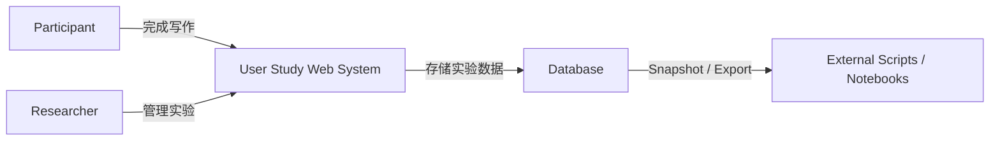
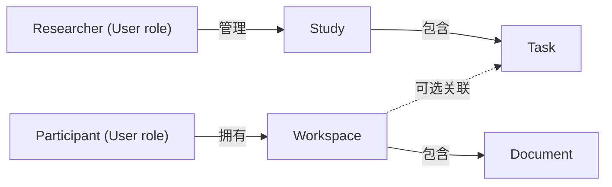
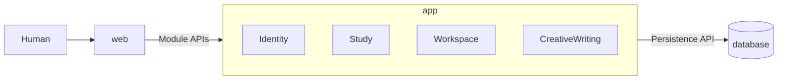

本文直接讨论一个 Web-based User Study 系统的代码架构设计，并以创意写作作为具体案例，首个内容格式采用 Markdown。Participant 可以开始 Task 并在 Workspace 中完成写作，也可以脱离 Study 创建 Workspace 自由写作；Researcher 则负责管理 Participants、设计 Study 和发布 Tasks。

先明确 system boundary：Web 系统负责实验运行与数据采集，不负责实验结果分析。分析由外部 scripts 或 notebooks 读取 database snapshot 或 exported data 完成。



创意写作足够简单，可以让讨论集中在多用户、角色权限、任务流程和数据隔离等核心问题；同时，Study、Task、Workspace 也能代表一类通用的 User Study 系统。

## 代码架构设计流程

代码架构设计从需求出发，逐步把业务问题转化为可以实现和验证的软件结构：

1. **Requirements Analysis**：明确系统目标、用户角色、核心场景和范围边界。
2. **Use Case Analysis**：描述不同角色如何使用系统，识别系统需要支持的核心操作。
3. **Domain Modeling**：从 Use Cases 中提取稳定的业务概念和规则，并识别可能变化的部分。
4. **Module Design**：划分业务 Modules，确定宏观代码目录、依赖方向和稳定的核心 APIs。
5. **Technical Decision**：确定会影响整体结构的技术选择，例如 application form、framework、database、authentication 和内容格式。

整个过程可以简化为：

```text
需求 → Use Case → 领域模型 → Module → Technical Decisions
```

完成这五个设计阶段后，再进入 **Implementation and Review**：实现一个可运行的 vertical slice，通过测试和实际开发中暴露的问题回看并修正设计。它是后续开发过程，而不是第六个设计阶段。

## 1. Requirements Analysis

系统的目标是构建一个多用户创意写作平台，并支持任务写作与自由写作两种模式。

系统中的用户统一表示为 `User`，并通过 `role` 区分两种角色：

- **PARTICIPANT**：使用账号密码自行注册和登录，参与 Study、开始 Task，并在 Document 中完成写作；也可以不参与 Study，直接自由写作。
- **RESEARCHER**：管理 Participants，并创建和管理 Study 与 Tasks。

Participant 的界面由多个 Workspaces 组成，每个 Workspace 包含一个 Document。开始 Task 会创建一个关联该 Task 的 Workspace；自由写作也会创建 Workspace，但不关联任何 Task。Participant 可以在 Workspace 中编辑、实时预览和保存 Document，并提交任务写作结果。

系统需要提供身份认证、基于角色的权限控制和 Participant 数据隔离；支持 Participant、Study 与 Task 管理、Workspace 创建与提交，以及 Document 编辑和实时预览。Participant 只能访问自己的 Workspaces 和 Documents，Researcher 可以管理 Participants 和 Studies，并查看基本运行状态。

本次实现只支持 Markdown；Plain Text、LaTeX 等格式不在当前范围内，但内容格式被视为可能变化的部分。

系统暂不涉及搜索、分享、多人协作、AI 写作和跨设备同步。

## 2. Use Case Analysis

这里采用最小形式描述 Use Case：

```text
Use Case = Actor + Action + Flow + Result
```

| ID | Actor | Action | Result |
|---|---|---|---|
| UC-01 | Participant | 注册账号 | 系统创建 `PARTICIPANT` 账号并建立登录状态 |
| UC-02 | Participant / Researcher | 登录系统 | 系统确认身份并授予对应角色的访问权限 |
| UC-03 | Participant | 查看 Studies | 系统显示当前可参与的 Studies 及其 Tasks |
| UC-04 | Participant | 开始 Task | 系统创建一个关联该 Task 的 Workspace 和 Document |
| UC-05 | Participant | 自由写作 | 系统创建一个不关联 Task 的 Workspace 和 Document |
| UC-06 | Participant | 查看 Workspaces | 系统显示该 Participant 拥有的 Workspaces |
| UC-07 | Participant | 编辑并保存 Workspace | 系统保存 Document，并允许提交任务写作结果 |
| UC-08 | Researcher | 管理 Study | 系统允许创建、编辑或关闭 Study 及其 Tasks |
| UC-09 | Researcher | 管理 Participants | 系统允许查看、禁用或删除 Participant |

其中，Flow 描述 Actor 完成目标时与系统交互的主要过程。这里只展开最具代表性的 `UC-04`：

**UC-04 开始 Task**

1. Participant 选择一个可参与的 Study，并查看其中的 Tasks。
2. Participant 开始一个 Task，系统验证 Study 和 Task 当前是否可用。
3. 系统创建归属于该 Participant 的 Workspace，并将其与 Task 关联。
4. 系统在 Workspace 中创建空白 Document，然后打开写作界面。

如果 Study 或 Task 已关闭，系统拒绝创建 Workspace。

## 3. Domain Modeling

Domain Modeling 从 Use Cases 中提取稳定的业务对象、关系和规则，而不是直接设计数据库表。这个系统包含 `User`、`Study`、`Task`、`Workspace` 和 `Document` 五个核心领域对象；Participant 和 Researcher 是 `User` 的两种角色。



`Study` 表示一项完整的研究设计，组织相关 Participants 和 Tasks。例如，“写作约束是否影响创造性”和“时间限制是否影响写作结果”是两个不同的 Studies；每个 Study 可以包含若干具体写作 Tasks。

`Task` 描述 Participant 要完成什么，`Workspace` 是 Participant 完成一次写作的工作空间，`Document` 则承载实际的创作内容。开始 Task 会创建关联该 Task 的 Workspace；自由写作创建的 Workspace 不关联 Task。

这里需要区分 Stable Core 和 Variation Points。`Study`、`Task`、`Workspace`、`Document` 及其归属关系是相对稳定的业务核心；Document 使用 Markdown、Plain Text 还是 LaTeX，则是可能变化的内容格式。

## 4. Module Design

Module Design 从业务能力出发划分职责边界。这里的 Module 是应用内部的一组相关对象和 Use Cases。

| Module | 拥有的对象 | 主要职责 |
|---|---|---|
| `Identity` | `User` | 注册、登录、角色权限和 Participant 管理 |
| `Study` | `Study`、`Task` | Study 与 Task 的查询和管理 |
| `Workspace` | `Workspace` | Workspace 的创建、归属、Task 关联和提交状态 |
| `CreativeWriting` | `Document` | Document 内容的创建、编辑和读取 |

每个 Use Case 可以涉及多个 Modules，但通常由一个主 Module 负责协调其业务目标：

| Use Case | 主 Module | 协作 Modules |
|---|---|---|
| UC-01 注册账号 | `Identity` | 无 |
| UC-02 登录系统 | `Identity` | 无 |
| UC-03 查看 Studies | `Study` | `Identity` |
| UC-04 开始 Task | `Workspace` | `Identity`、`Study`、`CreativeWriting` |
| UC-05 自由写作 | `Workspace` | `Identity`、`CreativeWriting` |
| UC-06 查看 Workspaces | `Workspace` | `Identity` |
| UC-07 编辑并保存 Workspace | `Workspace` | `Identity`、`CreativeWriting` |
| UC-08 管理 Study | `Study` | `Identity` |
| UC-09 管理 Participants | `Identity` | 无 |

以开始 Task 为例，跨 Module 流程由 Use Case 协调：

```text
StartTask
├── Identity：确认当前用户是 Participant
├── Study：确认 Task 可以开始
├── Workspace：创建关联 Task 的 Workspace
└── CreativeWriting：为 Workspace 创建 Document
```

完成业务职责划分后，再把 Module 边界映射为宏观代码目录和稳定的核心 APIs。

本项目采用一个 React full-stack codebase，不再拆分独立的 frontend 和 backend。`src` 按职责分为三部分：`web` 负责 React 页面、组件和 actions；`app` 包含四个业务 Modules；`database` 负责数据存取。整体结构如下：




这里共有五组核心接口：`Identity`、`Study`、`Workspace` 和 `CreativeWriting` 四组 Module APIs，以及 `app` 访问 database 的 `Persistence API`。`web` 不直接操作 database，而是通过 Module APIs 发起 Use Cases。代码目录如下：

```text
src/
├── web/
├── app/
│   ├── identity/
│   │   └── index.ts
│   ├── study/
│   │   └── index.ts
│   ├── workspace/
│   │   └── index.ts
│   └── creative-writing/
│       └── index.ts
└── database/
    └── index.ts
```

`app` 中的 `index.ts` 是对应 Module API 的公开入口，`database/index.ts` 是 Persistence API 的公开入口。APIs 使用稳定的业务动作命名，核心能力如下：

```text
Identity
├── registerParticipant(credentials) → SessionRef
├── authenticate(credentials) → SessionRef
├── requireRole(userId, role) → UserRef
├── listParticipants(researcherId) → ParticipantSummary[]
├── disableParticipant(researcherId, participantId)
└── deleteParticipant(researcherId, participantId)

Study
├── listAvailableStudies(participantId) → StudySummary[]
├── getStudy(actorId, studyId) → StudyDetails
├── getStartableTask(participantId, taskId) → TaskRef
├── createStudy(researcherId, input) → StudyRef
├── updateStudy(researcherId, studyId, input) → StudyRef
└── createTask(researcherId, studyId, input) → TaskRef

Workspace
├── startTask(participantId, taskId) → StartTaskResult
├── createFreeWorkspace(participantId) → WorkspaceRef
├── listWorkspaces(participantId) → WorkspaceSummary[]
├── getWorkspace(participantId, workspaceId) → WorkspaceDetails
├── saveContent(participantId, workspaceId, content) → WorkspaceRef
└── submitWorkspace(participantId, workspaceId) → WorkspaceRef

CreativeWriting
├── createDocument(workspaceId, content) → DocumentRef
├── getDocument(documentId) → DocumentDetails
└── saveDocument(documentId, content) → DocumentRef

Persistence
├── UserRepository
├── StudyRepository
├── TaskRepository
├── WorkspaceRepository
├── DocumentRepository
└── transaction(operation)
```

接口围绕稳定的业务动作设计：Module 只修改自身对象，跨 Module 通过公开 API 协作，输入输出不暴露 database model。`DocumentContent`、`credentials` 和 Repository interfaces 分别隔离内容格式、认证方式和持久化实现的变化。

这里还需要区分 runtime call 与 source code dependency。`app` 在运行时必然通过 Persistence API 调用 database，但 Persistence API 究竟应由 `database` 导出，还是由 `app` 定义并让 database 实现，会形成两种不同的依赖方向。这个问题需要先理解 [《依赖倒置原则》](/#/blog/dependency-inversion-principle)，再在 Persistence API 的具体设计中继续展开。

例如，`Workspace` Module 公开并协调 `StartTask`：

```text
Workspace.startTask(...)
├── Identity：验证角色
├── Study：验证 Task
├── Workspace：创建 Workspace
├── CreativeWriting：创建 Document
└── 返回 workspaceId 和 documentId
```

## 5. Technical Decision

Technical Decision 将前面的逻辑结构落实为一组技术基线。这里只记录影响系统整体结构且不容易替换的选择，不展开代码级实现细节。

| 方面 | 决策 |
|---|---|
| Application | TypeScript full-stack single codebase |
| Web | React + [React Router Framework Mode](https://reactrouter.com/start/modes#framework) |
| Persistence | PostgreSQL + [Prisma ORM](https://www.prisma.io/docs/orm) |
| Authentication | Username / Password + database-backed session；Participant 自助注册，Researcher 账号预置 |
| Content | 首先支持 Markdown，并保留可扩展的 `format` |

这些决定落实了 `web → app → database` 的整体结构和四个业务 Modules，但不改变它们的职责边界。具体 routes、database schema、password hashing、cookie 配置、ORM queries、editor 和 renderer libraries，留到 Implementation 中继续细化。
